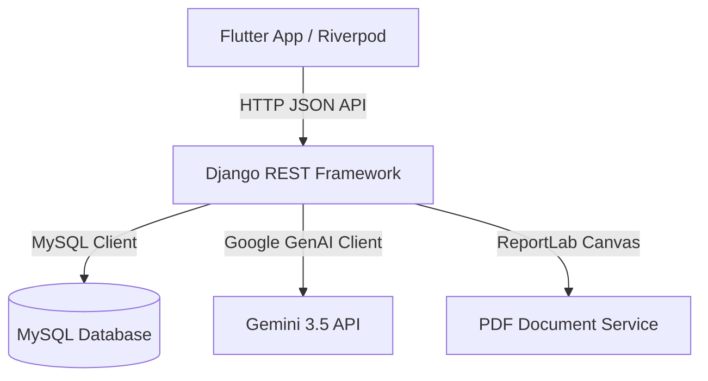

# 📱 TALXOne Sales CRM - Client Application

TALXOne Sales CRM is a premium, state-of-the-art enterprise client application built with Flutter, Riverpod, and Dart. It connects with a robust Django REST Framework backend and incorporates Google's cutting-edge **Gemini 3.5 Flash** models to deliver a secure, intelligent, and real-time CRM workflow.

---

## 🚀 Key Features

### 1. 🔐 Secure Enterprise Authentication
*   **JWT Token Persistence:** Secure storage of access/refresh tokens in local device memory (`SharedPreferences`).
*   **Silent Token Refresh:** HTTP Interceptor automatically intercepts `401 Unauthorized` responses and refreshes tokens silently in the background, preventing session disruption.

### 2. 📊 Reactive Performance Dashboard
*   **Live KPI Cards:** Displays critical performance stats (Total Revenue, Outstanding Receivables, Active Opportunities, Pending Invoices).
*   **AR Ageing Analytics:** Custom receivables metrics showing overdue balances grouped by aging bands (Current, 1-30 days, 31-60 days, 61-90 days, 90+ days) directly fetched from the ledger.

### 3. 💼 Sales Pipeline & Opportunities
*   **Document Auto-Numbering:** Sequential, race-condition-free unique document numbers (`OP-CRM-00001`, `QT-CRM-00001`, etc.) auto-generated securely at the database level.
*   **Activity Logs & Notes:** Record calls, emails, meetings, and follow-ups. You can set follow-up types to **"Task"** to easily track deliverables.

### 4. 📄 Quotations & Invoicing Engine
*   **Real-time Math & Tax Calculation:** Live subtotal, tax (e.g. 10% SST), discount, and grand total auto-calculates in the UI in real-time as you add and edit items.
*   **Approve-to-Order Conversion:** Tap "Approve" on any Quotation to immediately create a confirmed **Sales Order** (`SO-CRM-XXXXX`) in the pipeline, fully automated via database signals.
*   **On-the-fly PDF Generation:** Generate and download a formatted PDF invoice/quote directly through the ReportLab PDF service.

### 5. 🤖 Frontier AI Features (Gemini 3.5 Flash)
*   **AI Lead Scoring:** Evaluates opportunity cloisability, computes a 1-100 score, provides reasoning citing specific log note indicators, and displays a confidence warning.
*   **AI Stall Detection:** Automatic checks highlighting deals that have remained stationary for too long with a red warning banner.
*   **AI Sentiment Analysis & Action Items:** Extracts customer sentiment metrics and highlights immediate task lists directly from your raw meeting and call log notes.
*   **AI Contact Normalization:** Fast named-entity recognition (NER) to smart-fill Contact Name, Company, Email, and Phone directly from raw unstructured paste-board text.

---

## 🛠️ Project Architecture



*   **State Management:** State notifier providers managed by **Riverpod** for reliable, reactive widget rendering.
*   **Network Layer:** Dynamic HTTP client with retry interceptors.
*   **Database:** Fully migration-safe transactional MySQL relational backend.

---

## 🏁 Getting Started

### 1. Prerequisites
*   [Flutter SDK](https://flutter.dev/docs/get-started/install) (Stable channel)
*   [Python 3.9+](https://www.python.org/downloads/)
*   [MySQL Server](https://dev.mysql.com/downloads/installer/)

---

### 2. Backend Setup
1. Navigate to the backend directory:
   ```bash
   cd backend
   ```
2. Create and activate a Python virtual environment:
   ```bash
   python -m venv venv
   .\venv\Scripts\activate
   ```
3. Install dependencies:
   ```bash
   pip install -r requirements.txt
   ```
4. Set up your `.env` configuration:
   Create a `.env` file in the `backend/` directory matching the following layout:
   ```env
   SECRET_KEY=your-django-secret-key
   DEBUG=True
   DB_ENGINE=django.db.backends.mysql
   DB_NAME=talxone_crm
   DB_USER=root
   DB_PASSWORD=yourpassword
   DB_HOST=127.0.0.1
   DB_PORT=3306
   GEMINI_API_KEY=AIzaSy...
   USE_MOCK_AI=False
   ALLOWED_HOSTS=localhost,127.0.0.1
   ```
5. Apply database migrations:
   ```bash
   python manage.py migrate
   ```
6. Populate rich test dummy data (leads, quotes, invoices, accounts):
   ```bash
   $env:PYTHONPATH="."
   python scripts/populate_dummy_data.py
   ```
7. Start the development server:
   ```bash
   python manage.py runserver
   ```

---

### 3. Mobile App Setup
1. Navigate to the mobile app directory:
   ```bash
   cd mobile_app
   ```
2. Fetch Flutter packages:
   ```bash
   flutter pub get
   ```
3. Generate launcher icons and favicons for Android, iOS, and Web:
   ```bash
   flutter pub run flutter_launcher_icons
   ```
4. Launch the application:
   *   **Web Platform (Recommended for verification):**
       ```bash
       flutter run -d chrome
       ```
   *   **Web Server Fallback:**
       ```bash
       flutter run -d web-server --web-port=8080
       ```
   *   **Android/iOS Devices:** Connect your emulator or physical device and run:
       ```bash
       flutter run
       ```

---

## 🧪 Testing and Verification

### Django Test Suite
To verify the core logic, API permissions, and model calculations on the backend, run:
```bash
python manage.py test
```

### Mock AI Toggle
For offline development and testing, set `USE_MOCK_AI=True` in the backend `.env`. The backend will automatically return high-fidelity mock JSON matches containing pre-calculated pipeline statistics, contact details, and lead evaluations without hitting your Gemini API quota limits.
